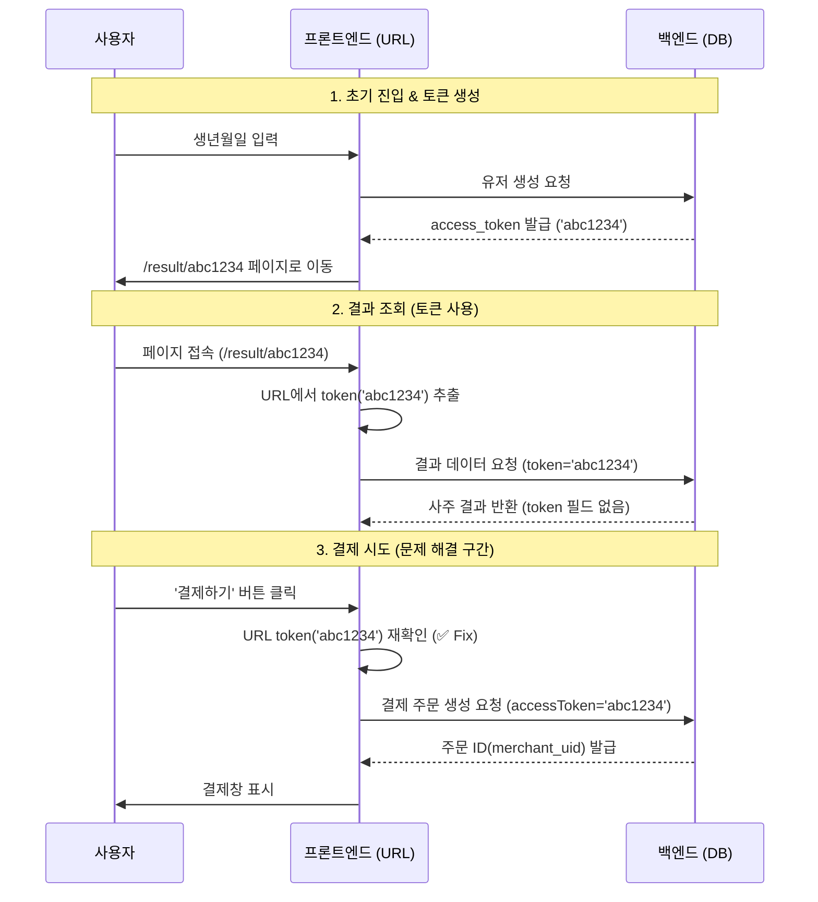

# 트러블슈팅: 결제 토큰 누락 문제 및 데이터 흐름 정리

## 1. 문제 상황 (The Problem)

### 현상
- 사용자가 결과 페이지(`ResultPage`)에서 **"천명록 발간하기(유료 결제)"** 버튼을 클릭했을 때, 아무런 반응이 없거나 결제 모듈이 실행되지 않고 종료됨.

### 원인 분석
1.  **프론트엔드 로직 오류**:
    - 결제 함수(`handlePdfPayment`, `handleBasicPayment`)가 `userInfo.access_token` 값을 사용하여 결제를 요청하도록 구현되어 있었음.
    - 코드: `if (!userInfo?.access_token) return;`
2.  **데이터 불일치**:
    - 백엔드 API(`/api/saju/result/:token`)는 사주 결과와 사용자 정보를 반환하지만, 보안/설계 및 불필요한 중복 방지를 위해 **`access_token` 필드를 응답 객체(`userInfo`)에 포함하지 않음**.
    - 따라서 `userInfo.access_token`은 항상 `undefined` 상태였고, 결제 함수는 시작하자마자 `return` 되어버림.

---

## 2. 해결 방법 (The Solution)

### 핵심 접근
- **"Source of Truth (진실의 원천) 변경"**
- 불확실한 백엔드 응답(`userInfo.access_token`)에 의존하는 대신, **이미 클라이언트가 URL 파라미터로 확실하게 보유하고 있는 토큰(`token`)을 직접 사용**하는 방식으로 변경.

### 코드 변경 (`src/pages/ResultPage.jsx`)

**Before (수정 전)**
```javascript
const { token } = useParams(); // URL에서 토큰 가져옴

const handleBasicPayment = async () => {
  // ❌ 백엔드 응답(userInfo)에 의존
  if (!userInfo?.access_token) {
    console.error('토큰 없음');
    return;
  }
  // ...
  createPayment({ accessToken: userInfo.access_token, ... });
};
```

**After (수정 후)**
```javascript
const { token } = useParams(); // ✅ 가장 확실한 토큰 소스

const handleBasicPayment = async () => {
  // ✅ URL 파라미터 토큰 직접 사용
  if (!token) {
    console.error('토큰 없음');
    return;
  }
  // ...
  createPayment({ accessToken: token, ... }); // 백엔드에 확실한 토큰 전달
};
```

---

## 3. 사용자 흐름 및 데이터 흐름 (User & Data Flow)

사용자가 서비스를 이용하며 결제하기까지의 **토큰(Token) 중심 흐름**입니다.

### 🛤️ 사용자 여정 (User Journey)

1.  **정보 입력 및 토큰 발급**
    *   **Action**: 사용자 생년월일 입력 및 "확인" 클릭
    *   **Data**: `POST /api/user/create` → 백엔드가 임시 사용자 생성 및 `access_token` 발급
    *   **Result**: 브라우저가 `/result/{access_token}` URL로 이동

2.  **결과 페이지 진입 (Access Result Page)**
    *   **Action**: 페이지 로드
    *   **Data**: 프론트엔드가 URL에서 `token` 추출 → `GET /api/saju/result/{token}` 요청
    *   **Flow**: "이 토큰(`token`) 가진 사람의 사주 결과 줘"

3.  **결제 요청 (Payment Request)**
    *   **Action**: "천명록 발간하기(결제)" 버튼 클릭
    *   **Token Usage**:
        *   프론트엔드는 **URL의 `token`**을 꺼내옴.
        *   `createPayment({ accessToken: token, ... })` 호출.
    *   **Flow**: **"지금 이 페이지 보고 있는(`token`) 사람 앞으로 주문서 만들어줘."**

4.  **결제 검증 및 완료 (Verification)**
    *   **Action**: PG사 결제 완료 후
    *   **Data**: 백엔드가 결제 내역 확인 후, 해당 유저(`token` 소유자)를 "유료 회원"으로 승격.
    *   **Result**: AI 상세 사주 풀이 생성 시작.

### 📊 데이터 흐름도



## 4. 결론 (Conclusion)

이 해결 방법은 **"명시성(Explicitness)"**과 **"무상태(Stateless)"** 원칙을 따르는 모범적인 방식입니다. 백엔드의 불필요한 응답 데이터 의존성을 제거하고, 클라이언트가 이미 보유한 **확실한 식별자(URL Token)**를 활용함으로써 시스템의 안정성을 높였습니다.

---

## 5. 결제 후 결과페이지 복귀 과정 (Payment Flow & Page State)

### 📱 전체 결제 플로우

결제 완료 후 **"천명록 발간하기" 버튼이 사라지는 과정**을 단계별로 설명합니다.

#### Step 1: 사용자가 "천명록 발간하기" 버튼 클릭

**조건**: `sajuResult.isPaid === false` 일 때만 버튼 표시

**위치**: `src/pages/ResultPage.jsx:1653`
```javascript
{!sajuResult.isPaid && (
  <button onClick={handleBasicPayment}>
    天 命 錄   발 간 하 기
  </button>
)}
```

#### Step 2: 결제 팝업 열림

**함수**: `handleBasicPayment()` (`src/pages/ResultPage.jsx:503`)

```javascript
const handleBasicPayment = async () => {
  console.log('💳 결제 시작 - token:', token);
  if (!token) {
    console.error('❌ token이 없습니다');
    return;
  }

  // 1. 백엔드에 결제 요청 생성 (DB에 pending 상태로 저장)
  const { merchantUid } = await createPayment({
    accessToken: token,  // ← 수정된 부분: URL token 직접 사용
    amount: 49000,
    productType: 'basic'
  });

  // 2. 포트원 결제 팝업 열기
  window.IMP.request_pay({
    pg: 'html5_inicis',
    merchant_uid: merchantUid,
    name: '천명록: 천기비록 (天機祕錄)',
    amount: 49000,
    buyer_name: userInfo.name,
    buyer_tel: userInfo.phone,
    m_redirect_url: `${window.location.origin}/payment/callback`
  }, async (rsp) => {
    if (rsp.success) await processBasicPaymentSuccess(rsp.imp_uid, merchantUid);
  });
};
```

**이 시점에 DB에 생성된 것**:
```sql
INSERT INTO payments (user_id, merchant_uid, amount, product_type, status)
VALUES (1, 'saju_1234567890_1', 49000, 'basic', 'pending');
```

#### Step 3: 사용자가 카드 정보 입력 후 결제 완료

포트원 팝업에서:
1. 카드번호 입력
2. 유효기간 입력
3. CVC 입력
4. "결제하기" 클릭 → 이니시스(PG사)로 결제 요청 전송

#### Step 4: 결제 성공 → 콜백 함수 실행

**함수**: `processBasicPaymentSuccess()` (`src/pages/ResultPage.jsx:541`)

```javascript
const processBasicPaymentSuccess = async (impUid, merchantUid) => {
  // 1. 백엔드에 결제 검증 요청
  const verify = await verifyPayment({
    imp_uid: impUid,
    merchant_uid: merchantUid
  });

  if (!verify.success) throw new Error(verify.error);

  // 2. 로딩 종료 (페이지 표시)
  setLoading(false);

  // 3. AI 계산 백그라운드 시작 (await 없음!)
  calculateSaju({ accessToken: token, ... })
    .catch(err => console.error('AI 계산 실패:', err));

  // 4. AI 완료 상태 폴링 시작
  startPollingForAiCompletion();
};
```

#### Step 5: 백엔드 결제 검증 과정

**API**: `POST /api/payment/verify` (`backend/src/controllers/paymentController.js:78`)

```javascript
export async function verifyPayment(req, res) {
  const { imp_uid, merchant_uid } = req.body;

  // 1. 포트원 API로 실제 결제 정보 조회 (위조 방지)
  const paymentInfo = await verifyPortonePayment(imp_uid, merchant_uid);

  // 2. DB에서 결제 정보 조회
  const [payments] = await db.execute(
    `SELECT * FROM payments WHERE merchant_uid = ?`,
    [merchant_uid]
  );

  // 3. 결제 상태 검증
  if (paymentInfo.status !== 'paid') {
    return res.status(400).json({ error: '결제가 완료되지 않았습니다.' });
  }

  // 4. 결제 금액 검증 (위조 방지)
  if (paymentInfo.amount !== payment.amount) {
    return res.status(400).json({ error: '결제 금액이 일치하지 않습니다.' });
  }

  // 5. 결제 상태 업데이트 (pending → paid)
  await db.execute(
    `UPDATE payments
     SET imp_uid = ?, status = 'paid', paid_at = NOW()
     WHERE merchant_uid = ?`,
    [imp_uid, merchant_uid]
  );

  // 6. 알림톡 발송 (비동기)
  sendResultLink({
    phone: user.phone,
    userName: user.name,
    resultUrl: `https://yourdomain.com/result/${user.access_token}`
  });

  // 7. 프론트엔드에 성공 응답
  res.json({ success: true, accessToken: user.access_token });
}
```

**이 시점에 DB 변경**:
```sql
UPDATE payments
SET imp_uid = 'imp_123456789', status = 'paid', paid_at = NOW()
WHERE merchant_uid = 'saju_1234567890_1';
```

#### Step 6: 페이지 새로고침 또는 재진입

사용자가 페이지를 **새로고침**하거나 **나갔다가 다시 들어오면**:

**함수**: `useEffect(() => { fetchResult(); }, [token])` (`src/pages/ResultPage.jsx:316`)

```javascript
useEffect(() => {
  const fetchResult = async () => {
    try {
      // 백엔드에서 사주 결과 + 사용자 정보 조회
      const response = await getSajuResult(token);

      setSajuResult(response.result);  // ← 여기에 isPaid 포함!
      setUserInfo(response.user);

      setLoading(false);
    } catch (err) {
      setError(err.message);
    }
  };
  fetchResult();
}, [token]);
```

#### Step 7: 백엔드에서 isPaid 계산

**API**: `GET /api/saju/result/:token` (`backend/src/controllers/sajuController.js:209`)

```javascript
export async function getSajuResult(req, res) {
  const { token } = req.params;

  // 1. 사용자 조회
  const [users] = await db.execute(
    `SELECT id, name FROM users WHERE access_token = ?`,
    [token]
  );
  const userId = users[0].id;

  // 2. 사주 결과 조회
  const [results] = await db.execute(
    `SELECT * FROM saju_results WHERE user_id = ?`,
    [userId]
  );

  // 3. 결제 여부 확인 ← 핵심!
  const [payments] = await db.execute(
    `SELECT id FROM payments
     WHERE user_id = ?
       AND product_type = 'basic'
       AND status = 'paid'`,  // ← status가 'paid'인지 확인!
    [userId]
  );

  const isPaid = payments.length > 0;  // ← 결제 레코드가 있으면 true

  // 4. 프론트엔드에 응답
  res.json({
    success: true,
    user: { id: userId, name: user.name },
    result: {
      ...result,
      isPaid: isPaid  // ← 여기서 isPaid 전달!
    }
  });
}
```

#### Step 8: 프론트엔드에서 버튼 숨김 처리

**렌더링 로직**: `src/pages/ResultPage.jsx:1653`

```javascript
{!sajuResult.isPaid && (  // ← isPaid === true이면 버튼 숨김!
  <button onClick={handleBasicPayment}>
    天 命 錄   발 간 하 기
  </button>
)}
```

**결제 전**:
- `sajuResult.isPaid = false` → 버튼 **표시** ✅

**결제 후**:
- `sajuResult.isPaid = true` → 버튼 **숨김** ❌

---

### 📊 전체 플로우 다이어그램

```
1. [사용자] "천명록 발간하기" 클릭
   ↓
2. [프론트] createPayment({ accessToken: token })
   → DB에 pending 상태 결제 생성
   ↓
3. [프론트] 포트원 결제 팝업 열림
   ↓
4. [사용자] 카드 정보 입력 후 결제
   ↓
5. [PG사] 이니시스에서 결제 처리
   ↓
6. [프론트] processBasicPaymentSuccess() 콜백 실행
   ↓
7. [프론트] verifyPayment({ imp_uid, merchant_uid })
   → 백엔드에 검증 요청
   ↓
8. [백엔드] 포트원 API로 실제 결제 확인
   ↓
9. [백엔드] DB에서 status를 'pending' → 'paid'로 업데이트
   ↓
10. [백엔드] 알림톡 발송 (비동기)
   ↓
11. [프론트] 페이지 새로고침 또는 폴링
   ↓
12. [프론트] getSajuResult(token) 호출
   ↓
13. [백엔드] payments 테이블에서 status='paid' 확인
   ↓
14. [백엔드] isPaid = true 반환
   ↓
15. [프론트] sajuResult.isPaid = true 설정
   ↓
16. [UI] "천명록 발간하기" 버튼 숨김 ✅
```

---

### 🔑 핵심 포인트

1. **버튼 표시 조건**: `!sajuResult.isPaid`
2. **isPaid 계산 위치**: 백엔드 `getSajuResult()` 함수에서 `payments` 테이블 조회
3. **결제 상태 변경**: `verifyPayment()`에서 `status = 'paid'`로 업데이트
4. **페이지 새로고침 없이도**: 폴링으로 AI 완료 상태 확인 중 `isPaid`는 이미 `true`
5. **토큰 사용**: URL의 `token` 파라미터를 일관되게 사용하여 사용자 식별

실제로 **페이지를 새로고침하거나 나갔다가 다시 들어오면** `getSajuResult(token)`가 다시 호출되어 `isPaid = true`를 받아오므로 버튼이 사라집니다!
